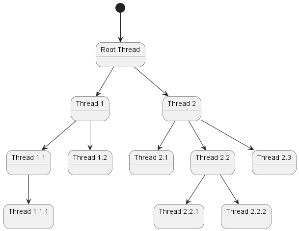
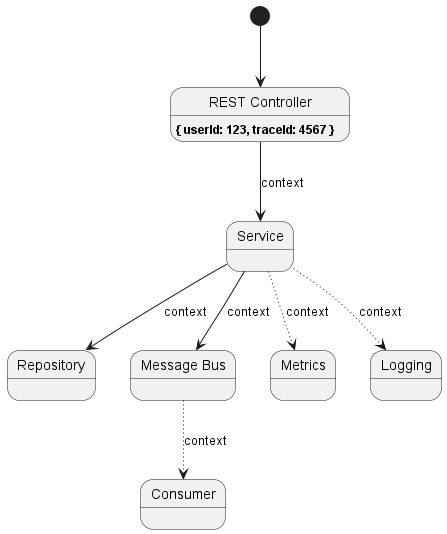

# Async Context

## Circumstance

* There is contextual information, that must be available further down the call tree.
* Some branches of the call tree can be executed in different threads.
* Threads are reusable and taken from a thread pool.
* There is no possibility/desire to explicitly pass the context through the entire call tree.

## Concept

A method context is contextual information available in the method. We can think of the context as
a set of local and global variables, class fields, etc. All that the method can use to do its deal.
Sometimes we need to share some part of that context with all the methods further down the call tree.
For that purpose there are several options we usually use:

* method parameters;
* shared dependencies;
* closures;
* global variables.

Yes, we can pass some data by using method parameters but adding an extra parameter means that we must
change signatures of all methods beneath. Sometimes it is not possible. For example, a third party library
works somewhere in the call tree; or it can spoil the design of invoked components; or you do not want to
change signatures every time the context extends.

Passing data through shared dependencies works like global variables. For example, two classes depend on
a third one, thus the latest can be used as a context holder. In other words, you can store the context
in one method and restore it in others as needed. This approach is good enough and solves the aforementioned
problem with method parameters. However, using shared dependencies could be difficult if we need to pass
a *local* context related only to the current call tree because it is unclear when we will be able to dispose
this context and remove all references to it. Sure, we can automate it by somehow counting references,
but this is an unnecessary complication. Either way this approach stop working as soon as a call tree
becomes asynchronous i.e. some of its branches are executed in different threads.



With increasing of complexity of your system passing the context data becomes harder and difficult to maintain.
Unlikely you would like to think about these absolutely technical details every time when extend a context
or make some path of a call tree asynchronous.

Suppose that you implement a regular web-application and one of its method. It is easy to imagine that some
stages of the method algorithm are already asynchronous or will be asynchronous. Nevertheless, on each stage
of the algorithm you would like to know which user is performing the method. For example, the repository can
filter data by user; the logger can include to messages the user and trace IDs, etc.



An instance of the [`IAsyncContext`](../asynchronizer/src/main/java/ru/asynchronizer/util/concurrent/IAsyncContext.java) interface
represents data related to an asynchronous control flow. Its implementing is inspired by the .NET
[`AsyncLocal<T>`](https://learn.microsoft.com/en-us/dotnet/api/system.threading.asynclocal-1) class.
It solves all aforementioned problems, hides technical details, eliminates restrictions of the
[`ThreadLocal<T>`](https://docs.oracle.com/en/java/javase/21/core/thread-local-variables.html).

## Using

The `IAsyncContext` interface can be used to persist data across threads. The context is organized
as a hash table which keys are names of the context properties. Call the `setProperty()` method
to set the value of a context property; call the `getProperty()` method to restore the value.

```java
IAsyncContext context = Asynchronizer.context();

// The REST-controller thread
context.setProperty("userId", 123);

// The Repository thread
var userId = context.getProperty("userId"); // 123
```

To make this magic work you need to follow the next two rules:

* To access the `IAsyncContext` instance use the [`Asynchronizer.context()`](../asynchronizer/src/main/java/ru/asynchronizer/util/concurrent/Asynchronizer.java) method.
* To create a new thread or an executor use the [`IExecutorFactory`](../asynchronizer/src/main/java/ru/asynchronizer/util/concurrent/IExecutorFactory.java) instance provided by the [`Asynchronizer.executorFactory()`](../asynchronizer/src/main/java/ru/asynchronizer/util/concurrent/Asynchronizer.java) method.

Additionally, if you do not need a special executor, use common ones:

* `Asynchronizer.commonPool()`
* `Asynchronizer.commonScheduledPool()`

Also, there is ability to set up the global handler for uncaught exceptions:

```java
Asynchronizer.setUncaughtExceptionHandler((uncaughtException) -> {
    log.atError().setCause(uncaughtException).log("The unexpected exception occurred.");
});
```

As your application stops, better to invoke the `Asynchronizer.shutdown()` method first to terminate all asynchronous activity gracefully.

## Links

* [`AsyncCompletableFuture`](async-completable-future.md)
