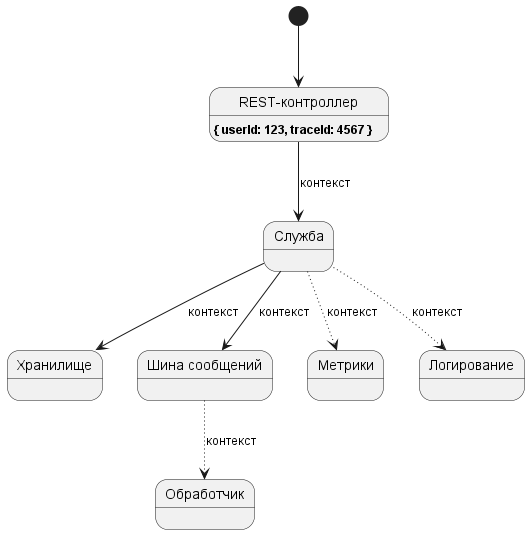

# Асинхронный контекст

## Обстоятельство

* Имеется контекстная информация, которая должна быть доступна ниже по дереву вызовов.
* Некоторые ветки дерева вызовов могут исполняться в различных потоках.
* Потоки повторно используются и могут браться из пула потоков.
* Нет возможности/желания передавать контекст в явном виде через всё дерево вызовов.

## Концепция

Контекст метода - это контекстная информация, доступная методу. Мы можем думать о контексте как
о наборе локальных и глобальных переменных, членов классов и т.д. Всё, что метод может использовать для решения своих задач.
Иногда нам необходимо разделять некоторую часть этого контекста со всеми методами ниже по стеку вызова.
Для этих целей есть несколько вариантов, которыми мы обычно пользуемся:

* параметры методов;
* разделяемые зависимости;
* замыкания;
* глобальные переменные.

Да, мы можем передавать данные, используя параметры методов, но добавление дополнительных параметров значит, что мы должны
изменить сигнатуру всех нижележащих методов. Иногда это невозможно. Например, где-то в дереве вызовов работает
сторонняя библиотека; или это может испортить дизайн вызываемых компонентов; или вы не хотите
изменять сигнатуры каждый раз при изменении контекста.

Передача данных через разделяемые зависимости работает подобно глобальным переменным. Например, два класса зависят от
третьего, значит, последний может быть использован, как держатель контекста. Иными словами, вы можете сохранить контекст
в одном методе и восстановить его в других, когда нужно. Этот способ работает достаточно хорошо и решает вышеупомянутую
проблему с параметрами методов. Однако использование разделяемых зависимостей может быть осложнено, если нам необходимо передать
*локальный* контекст, связанный только с текущим деревом вызовов, поскольку неясно, когда мы сможем освободить
этот контекст и удалить все ссылки на него. Конечно, мы можем автоматизировать это, каким-то образом подсчитывая ссылки,
но это неоправданное усложнение. В любом случае такой подход перестанет работать сразу, как только дерево вызовов
станет асинхронным, т.е. некоторые его ветки будут исполняться в разных потоках.


С увеличением сложности вашей системы передача контекстных данных становится всё сложней и труднее в обслуживании.
Вряд ли вам хочется думать об этих абсолютно технических деталях каждый раз, когда расширяете контекст
или делаете некоторые пути дерева вызовов асинхронными.

Предположим, что вы реализуете обычное web-приложение и один из его методов. Достаточно просто представить, что некоторые
стадии алгоритма этого метода уже асинхронные или будут асинхронными. Тем не менее на каждой стадии
алгоритма вы хотели бы знать, какой пользователь исполняет метод. Например, хранилище может
фильтровать данные по пользователю; журнал может включать в сообщения идентификаторы пользователя и запроса; и т.д.



Экземпляр интерфейса [`IAsyncContext`](../asynchronizer/src/main/java/ru/asynchronizer/util/concurrent/IAsyncContext.java)
представляет данные, связанные с асинхронным потоком управления. Его реализация вдохновлена классом .NET
[`AsyncLocal<T>`](https://learn.microsoft.com/ru-ru/dotnet/api/system.threading.asynclocal-1).
Он решает все вышеупомянутые проблемы, скрывает технические детали, устраняет ограничения
[`ThreadLocal<T>`](https://docs.oracle.com/en/java/javase/21/core/thread-local-variables.html).

## Использование

Интерфейс `IAsyncContext` может использоваться для сохранения данных, передаваемых через потоки. Контекст организован
как хэш-таблица, ключами которой являются имена свойств контекста. Для установки значения свойства используйте метод
`setProperty()`; для получения значения - метод `getProperty()`.

```java
IAsyncContext context = Asynchronizer.context();

// Поток REST-контроллера
context.setProperty("userId", 123);

// Поток хранилища
var userId = context.getProperty("userId"); // 123
```

Чтобы заставить эту магию работать, вам необходимо следовать двум правилам:

* Для доступа к экземпляру `IAsyncContext` используйте метод [`Asynchronizer.context()`](../asynchronizer/src/main/java/ru/asynchronizer/util/concurrent/Asynchronizer.java).
* Для создания нового потока или исполнителя используйте экземпляр [`IExecutorFactory`](../asynchronizer/src/main/java/ru/asynchronizer/util/concurrent/IExecutorFactory.java), предоставляемый методом [`Asynchronizer.executorFactory()`](../asynchronizer/src/main/java/ru/asynchronizer/util/concurrent/Asynchronizer.java).

Дополнительно, если вам не нужен специальный исполнитель, используйте один из общих:

* `Asynchronizer.commonPool()`
* `Asynchronizer.commonScheduledPool()`

Также есть возможность установить глобальный обработчик для неперехваченных исключений:

```java
Asynchronizer.setUncaughtExceptionHandler((uncaughtException) -> {
    log.atError().setCause(uncaughtException).log("Возникло непредвиденное исключение.");
});
```

Перед остановкой приложения лучше вызвать метод `Asynchronizer.shutdown()`, что позволит корректно завершить все асинхронные задачи.

## Ссылки

* [`AsyncCompletableFuture`](async-completable-future.ru.md)
